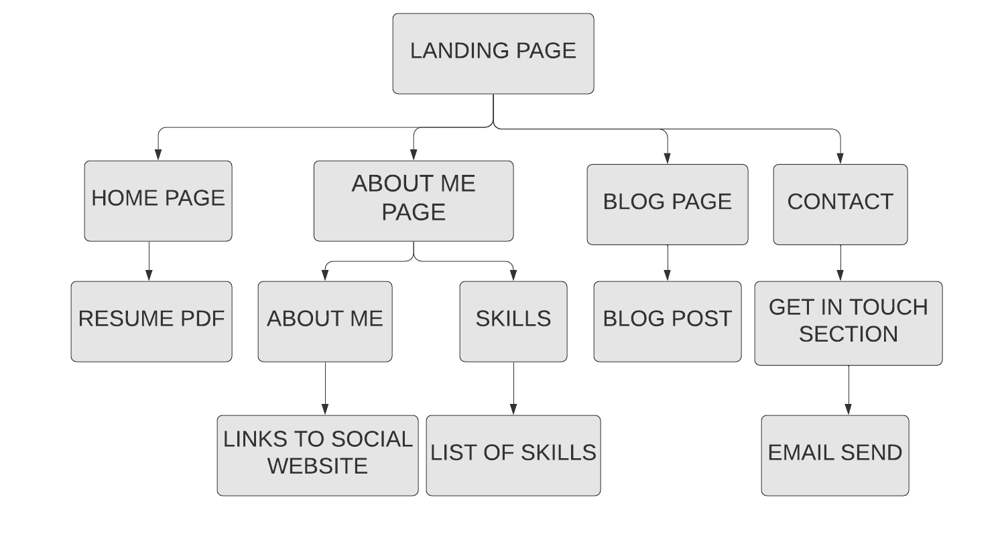
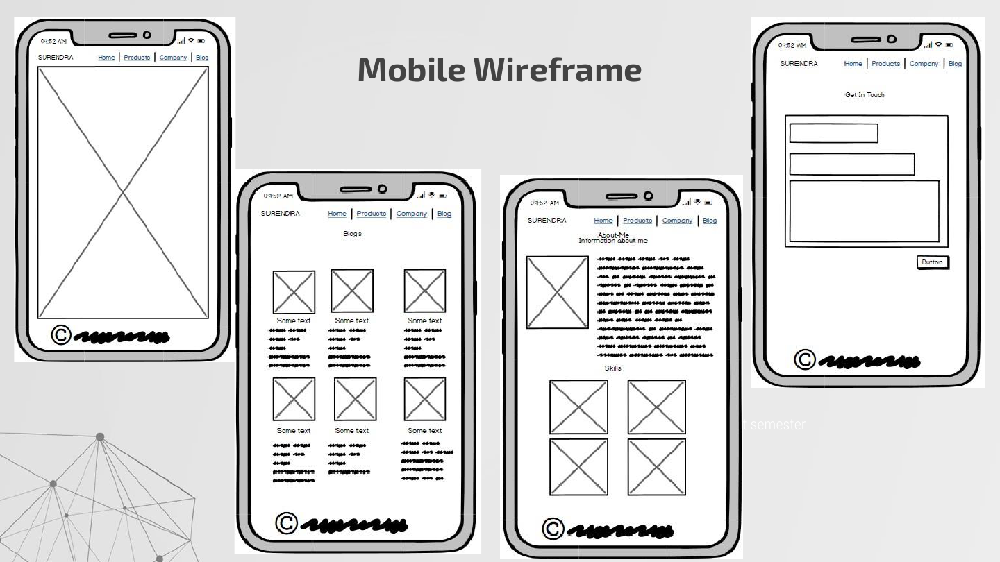
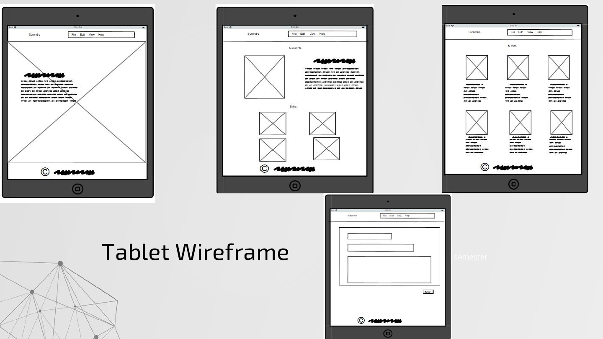
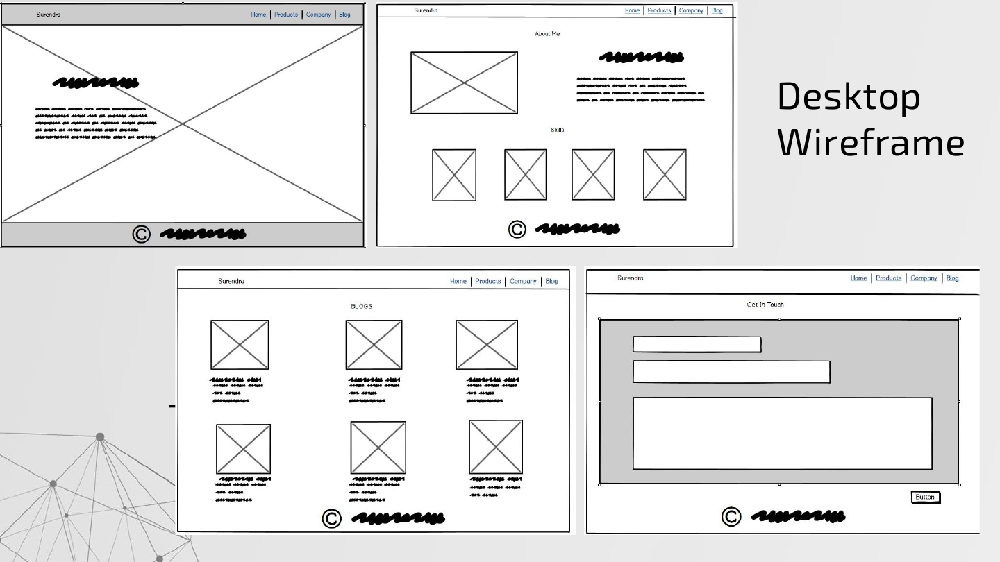

#### Portfolio Site: [Link](https://surendrasapkale.netlify.app/)

#### GitHub Repo Link:  [Link](https://github.com/SurendraSapkale/Portfolio)

## Purpose

The purpose of this website is to act as a digital portfolio to showcase my work, technical skills & expertise, so that potential employers, clients and recruiters have all relevant information easily accessible as and when required.

## Features and Functionality

This website mainly gives the complete information about me.

Below are the features:

- Complete professional look and feel of my website design
- Fixed navigation bar
- To view and download the resume
- Showcase my technical skills
- To see my completed projects details  
- Various socials links like LinkedIn, twitter, github, to see my my activities. 
- Look into my blogs, that how I express myself.
- Option to send email
- Website can be access from various devices.

## Sitemap

## Wireframe & Design

#### Mobile wireframe:

#### Tablet wireframe:

#### Desktop wireframe:

## Website Screenshots

#### **Desktop View**

#### Mobile Screenshot

#### Tablet Screenshot

## Target audience

My portfolio was created to show any future employee, clients and potential recruiter. They can easily access my personal and professional information by navigating this website.

## Tech Stack

Technologies and tolls used to create this portfolio are:

- Balsamiq Wireframes
- HTML
- CSS (styling, animations, responsiveness)
- Flexbox
- Google Fonts
- Icons imported from font awesome

